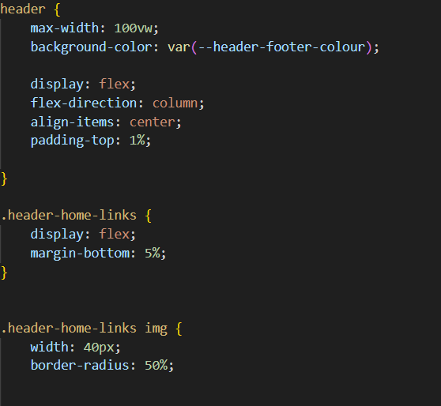
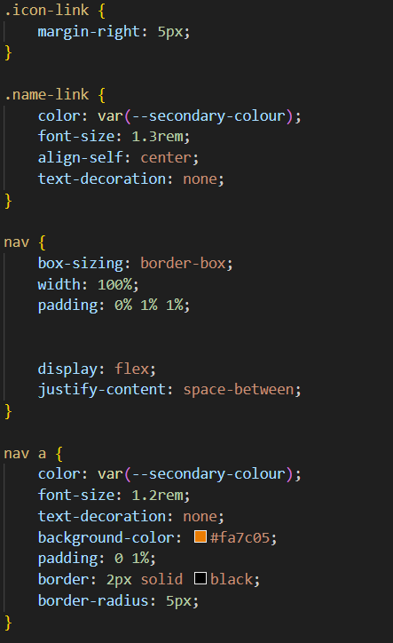

# Portfolio 

## Overview
This project is basic portfolio site about myself, Earvin Tumpao. This site will contain 5 webpages, the homepage, an About page, Skills page, Work page, and Contact page. Below will be details outlining all these different pages. 

This document will be updated as the project continues. 

## Homepage
The homepage is the main page the user will see when accessing the site. The header and footer of the hompage is the same on all other pages on the site.

### Header 
The header contains an icon and name which both link back to the homepage. It also contains a nav bar that has links to the other pages on the site. 

This is the HTML code for the header:

```HTML
<header>
    <div class="header-home-links">
        <a href="#" class="icon-link">
            
        </a>
        <a href="#" class="name-link">
            Earvin Tumpao
        </a>
    </div>

    <nav>
        <a href="pages/about.html">About</a>
        <a href="pages/skills.html">Skills</a>
        <a href="pages/work.html">Work</a>
        <a href="pages/contact.html">Contact</a>
    </nav>
</header>
```
And this is the CSS styling for the header: 




### Footer 
The footer contains 3 icons which link to my social media pages, LinkedIn, Github, and Instagram. 

### Main content 
The main content consists of a main photo of myself and a brief overview of the purpose and content of the website and it's pages.

